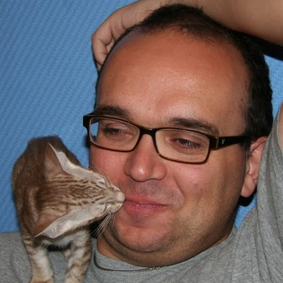

# JKrag Bio



## The Fun Stuff

I am a multi-cultural, multi-interest personality with way more hobbies that I have time for. To name a few: I breed and show pedigree cats, teach genetics, collect Rubiks cubes, breed DINOSAURS, build kites and go to kite festivals, snowboard yearly and am occasionally a bit serious about road biking.
On top of that I have a odd fascination of programming languages, from the mainstream over the niche to the downright odd, and spured by this interest I started a Polyglot programming Meetup group two years ago, which now has over 430 members. 

```

             .-=-==--==--.
       ..-=="  ,'o`)      `.
     ,'         `"'         \
    :  (                     `.__...._
    |                  )    /         `-=-.
    :       ,vv.-._   /    /               `---==-._
     \/\/\/VV ^ d88`;'    /                         `.
         ``  ^/d88P!'    /             ,              `._
            ^/    !'   ,.      ,      /                  "-,,__,,--'""""-.
           ^/    !'  ,'  \ . .(      (         _           )  ) ) ) ))_,-.\
          ^(__ ,!',"'   ;:+.:%:a.     \:.. . ,'          )  )  ) ) ,"'    '
          ',,,'','     /o:::":%:%a.    \:.:.:         .    )  ) _,'
           """'       ;':::'' `+%%%a._  \%:%|         ;.). _,-""
                  ,-='_.-'      ``:%::)  )%:|        /:._,"
                 (/(/"           ," ,'_,'%%%:       (_,'
                                (  (//(`.___;        \
                                 \     \    `         `
                                  `.    `.   `.        :
                                    \. . .\    : . . . :
                                     \. . .:    `.. . .:
                                      `..:.:\     \:...\
                                       ;:.:.;      ::...:
                                       ):%::       :::::;
                                   __,::%:(        :::::
                                ,;:%%%%%%%:        ;:%::
                                  ;,--""-.`\  ,=--':%:%:\
                                 /"       "| /-".:%%%%%%%\
                                                 ;,-"'`)%%)
                                                /"      "|
```

## Git and GitHub Experience

I have been using Git for about 4-5 years now, and consider myself a rather advanced user. I have been teaching numerous 2-day Git courses that venture into the lands of rather advanced topics, and even on the beginner courses, I include a rather significant section on Git internals as I find this to be a very useful piece of of the puzzle in order to really understand git and get full benefits. I ahve been using Github on and off for some years, mostly when contributing smaller things to OS projects, and have used it quite a lot since Praqma started managing most of our projects with GitHub issues.


## Teaching Experience

Currently I am also a certified Trainer for Docker, and have run their 2-day introductory course 3-4 times in the past 8 months. I have recently played a major part in teaching Praqma's Code Academy to 40+ students, where I taught Git and Docker and ran much of the workshop.

In my free time I have frequently been teaching Feline (cat) genetics for most of the Danish cat clubs for the past nearly 20 years, the recent 10 together with my wife. We love the challenge of communicating a rather geeky subject and making it accessible to people without any science background.

## Development Experience

After a childhood with ZX Spectrum and Amiga 500, and coding small amounts of BASIC, I crossed a wide range of languages at university, from standard Pascal over APL to the OO world of C++ and a thesis web project written entirely in PL/SQL. I have worked professionally as a developer for 17 years, mostly with Java and related stuff.

In that period I numerous culture revolutions in the VCS spectrum from RCS, over CVS and SVN to the distributet tools, having used Mercurial for some time before setteling into Git.

## Languages

I am quite comfortable teaching in English and Danish. I could probably even get away with German if needed, or at least a bilingual English/German setup like teaching in English and answering questions in German.

## Self-Assessment

Listing all the git commands I know, including description, would be a rather daunting task, so here are some of my favourites of the top of my head:

<dl>

<dt>git cherry-pick</dt>

<dd>Select a single commit by reference, and apply the changes to your current branch.</dd>

<dt>git rebase -i</dt>

<dd>Start an interactive rebase to rewrite and clean your history</dd>

<dt>git cat-file -p</dt>

<dd>Pretty print the internal content of a ZLib compressed object in the Git object model. Mostly useful when teaching :-D</dd>

<dt>git slog (my alias for something like "git log -n1 --oneline --decorate" but with custom colours.</dt>

<dt>git pull --rebase</dt>

<dd>The only way to fly...</dd>

<dt>git reflog</dt>

<dd>Always useful to see where you have been</dd>

<dt>git remote show [remote name]</dt>

<dd>Show info about your remote</dd>

<dt>git config [--global] ....</dt>

<dd>Add, view or edit your config</dd>

<dt>git commit --allow-empty</dt>

<dd>Allow git to commit even without adding new content. Useful for initial commits or for fast experimenting while teaching.</dd>

</dl>

Alternatively, my ["Git Achievements" status page](http://jkrag.github.io/git-achievements/) might be a fun place to look, although I don't think I am still using this extension.
